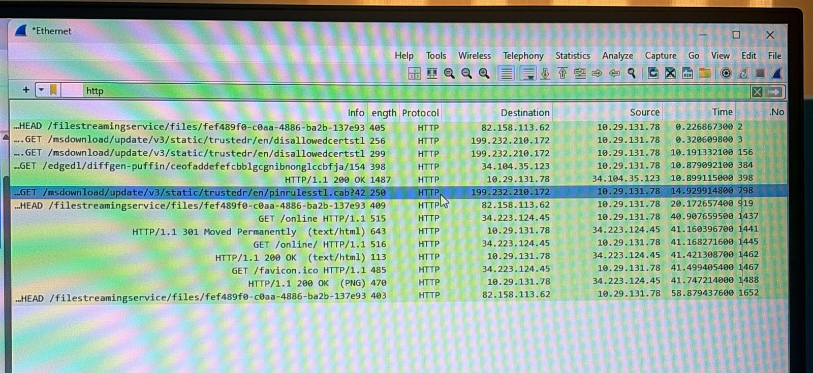
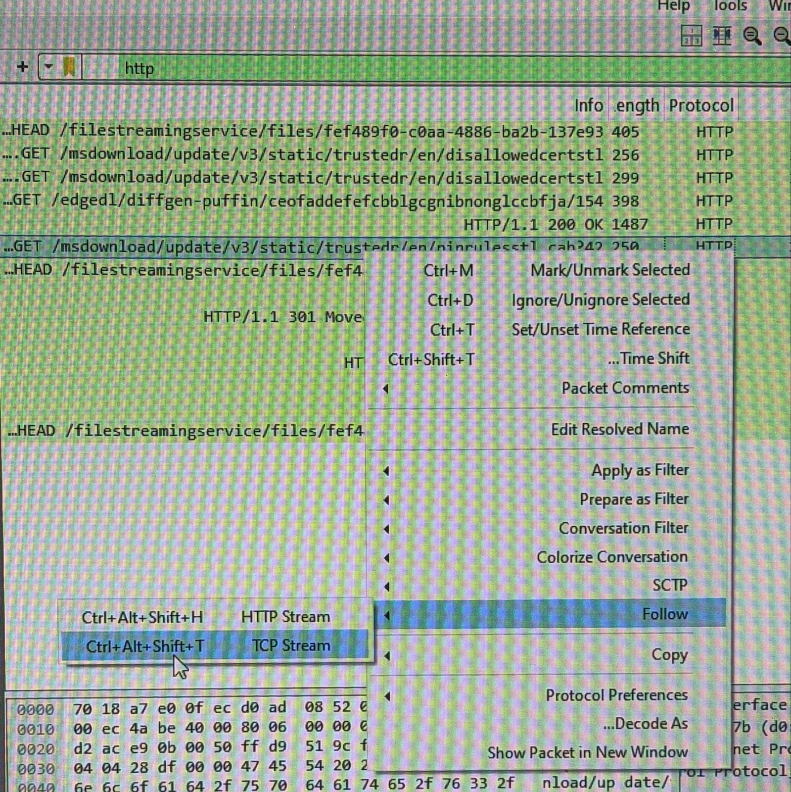
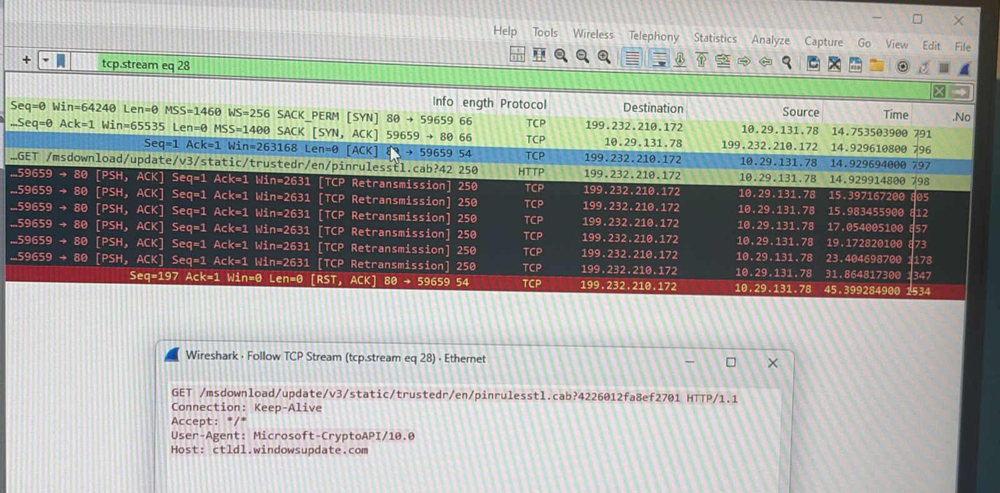
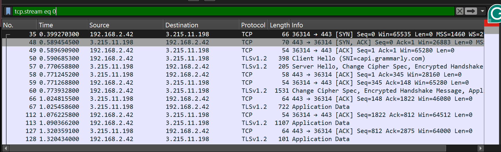
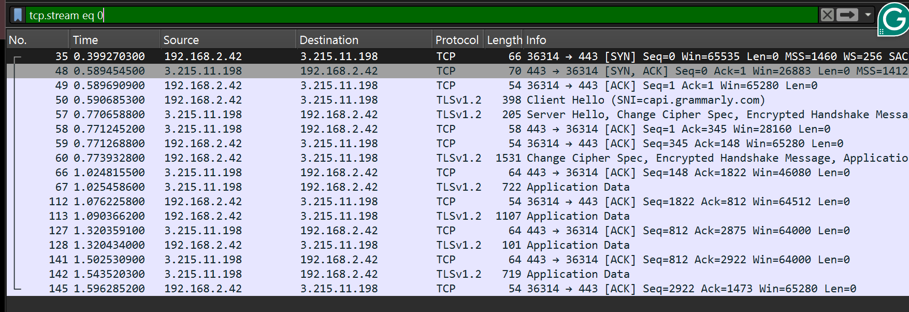
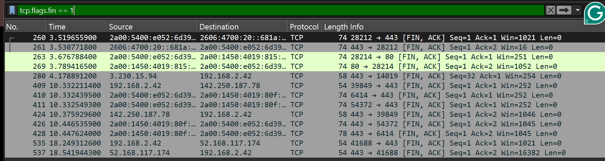
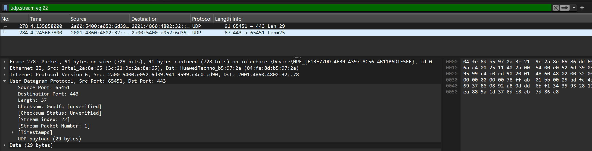

# Wireshark Lab 1

## HTTP, TCP/IP, and UDP Traffic Analysis

This repository contains the results and screenshots from Wireshark Lab 1.
The lab demonstrates HTTP traffic analysis, TCP connection establishment,
TCP data transfer and termination, and UDP traffic analysis.

---

## Part 1: HTTP Traffic Analysis

HTTP packets were captured and filtered using Wireshark to observe HTTP
request and response traffic.

### Follow TCP Stream

The TCP stream was followed to examine the communication between the
client and the server.

### TCP Stream Analysis

The selected TCP stream shows the communication between the client
and server.

---

## Part 2: TCP/IP Traffic Analysis

### TCP Three-Way Handshake

The TCP connection establishment was observed using the three-way handshake:

1. SYN
2. SYN, ACK
3. ACK

### TCP Data Transfer

Data transfer between the client and server was observed after the
TCP connection was established.

### TCP Connection Termination

The TCP connection termination process was observed using FIN and ACK
packets.

---

## Part 3: UDP Traffic Analysis

UDP traffic was captured and filtered using Wireshark.

The selected UDP packet was analyzed to observe:
- Source Port
- Destination Port
- Length
- UDP Payload

---

## Part 4: TCP and UDP Comparison

The comparison between TCP and UDP, including reliability, connection
establishment, data ordering, use cases, and performance, is available
in the following file:

[TCP-UDP Comparison](TCP-UDP-Comparison.md)

---

## Conclusion

This lab demonstrated the main characteristics of HTTP, TCP, and UDP
traffic using Wireshark. TCP establishes a connection using a three-way
handshake and provides reliable and ordered communication. UDP is
connectionless and has lower communication overhead than TCP.
